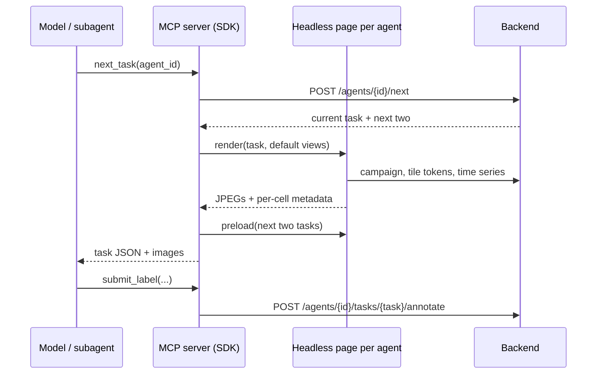

# Agentic labelling

A model can label the tasks of a campaign, alone or as a team of subagents. It works
through the `stacnotator` MCP server in the SDK: it looks at packed images of the imagery
around each task, asks for more detail when a point is unclear, and submits labels like any
other annotator.

## Setup

Install the plugin, which brings the labelling skill and the MCP server. You need
[uv](https://docs.astral.sh/uv/); there is nothing to clone or run yourself.

Claude Code:

```
/plugin marketplace add RAAPID-ORG/stacnotator
/plugin install stacnotator@stacnotator
```

Codex:

```bash
codex plugin marketplace add RAAPID-ORG/stacnotator
codex plugin add stacnotator@stacnotator
```

The agent always asks which STACNotator to use and needs its full URL. Then ask, e.g. "label 20 points of the Ukraine winter crop campaign on
https://your-stacnotator.example.org with 4 agents". The agent signs you in through a
browser tab the first time and asks once before downloading Chromium (about 150 MB), which
draws the images. The first start takes a minute while uv installs the SDK.

Other MCP clients: run
`uvx --from "stacnotator-sdk[agent] @ git+https://github.com/RAAPID-ORG/stacnotator#subdirectory=sdk" stacnotator-mcp`
over stdio and give the model
[`sdk/skills/stacnotator-labelling/SKILL.md`](../sdk/skills/stacnotator-labelling/SKILL.md).

On a bare Linux machine Chromium may also need system libraries:
`uvx playwright install-deps chromium` (needs sudo).

A campaign with point tasks needs a sample extent set: it is the red box drawn around each
point so the model knows what it is labelling.

## Running a labelling run

Ask in plain words, e.g. "label 20 points of the Ukraine winter crop campaign with 4 agents".
The skill asks for whatever is missing (campaign, number of points, number of agents), then:

1. registers one agent per worker, with the points split evenly and take-over switched on,
2. launches one subagent per agent, each looping next task, extra views when needed, label or skip,
3. reports a table of task, label, confidence and evidence.

Registering also opens a window on your screen with each agent's latest views, which
explains what you are looking at and where to follow progress; closing it does not stop the
agents, and `watch_agents` reopens it. If you stop a run early, ask it to free the agents'
tasks, or use the Agents page.

## How it works



- **Who can run agents.** Only project members. Campaign admins hand agents tasks from the
  open pool; other members only the tasks assigned to themselves, and freeing an agent's
  unfinished tasks gives them back to that member. At most 20 agents per person in a
  campaign.
- **Agents are annotators.** Registering creates a user owned by the signed-in account, adds
  it to the project and assigns it tasks with the normal assignment code. Labels, skips,
  statistics and review rows are ordinary annotations. `data.labelling_agents` only records
  the owner, campaign, description and the take-over setting.
- **Agents are not members.** They hold a project membership row so assignments work, but a
  run is temporary, so they are left out of the project members list, the users an admin can
  add, and the campaign's `users.csv`. Their work still shows up wherever annotations are
  attributed: statistics, the review page and the annotation exports.
- **Nothing is rendered on the server.** The MCP server opens `/agent-render?campaign=<id>`
  of the app in its own browser context per agent (so agents do not share tile connections)
  and calls `window.stacnotatorAgent` on it. The page draws with the same catalog, tile URLs,
  Planet scene search and time series code as the annotation page and returns the images.
  It signs in with the SDK login, which the MCP server hands to the page on request.
- **Campaign context and default views come from the page**, built from the campaign it
  loaded: sources with collections and slices, basemaps, time series, labels, form fields
  and the guide.
- **Views.** A view is a grid of cells, each a slice (with a visualization), a basemap or a
  time series chart (optionally cloud-free and smoothed), at a zoom and cell size the model
  picks. Each cell carries a short readable label (`#3 May 2025, z17`); the metadata adds
  the exact dates, zoom, meters per pixel, the time series values and, for point tasks, the
  pixels inside the sample extent as numbers (mean colour, a green index, the share of
  bright and of missing pixels). Areas without tiles are hatched and flagged, and the red box
  is drawn outside the extent so nothing inside it is covered.
- **Image limits.** Models downscale large images before they see them, which silently
  loses detail. The model states the largest image it takes in unchanged when it registers
  an agent, and every view is fitted to that by shrinking its cells.
- **Step by step per point.** `next_task` returns a light first look (a few dates spread over
  the season, zoomed on the point, the time series and a basemap pair); the agent then calls
  `get_views` on the same point as often as it needs for other dates, zooms, cell sizes,
  visualizations or basemaps. Drawn views are cached, so asking again costs nothing.
- **Preloading.** Every `next_task` draws the agent's default views for its next two tasks in
  the background, so a steady loop gets its images without waiting. Default views live in
  the MCP server's memory and reset when it restarts.
- **Take-over.** An agent with take-over on that runs out of tasks takes the last queued task
  of the owner's agent on the campaign with the most work left.

## Agents page

`/projects/<p>/campaigns/<c>/agents` lists your agents on a campaign with done and remaining
counts and when each last submitted a label, so a run that died is easy to spot. From there you can switch take-over per agent and free the unfinished tasks of one
agent or of all of them; labelled and skipped tasks stay. The page also explains the feature
and how to install the plugin, and the campaign overview links to it under the task sets.

## API

| route | |
| --- | --- |
| `POST /campaigns/{id}/agents` | register an agent and assign it `task_count` tasks |
| `GET /campaigns/{id}/agents` | total and open tasks, and your agents with their progress |
| `POST /campaigns/{id}/agents/release-tasks?agent_id=` | free unfinished tasks of one or all of your agents |
| `GET /agents/{agent_id}` | one agent |
| `PATCH /agents/{agent_id}` | switch take-over |
| `POST /agents/{agent_id}/next` | the current task and the next two, taking over work when empty |
| `POST /agents/{agent_id}/tasks/{task_id}/annotate` | label or skip |

## Limits

- Everything runs on the machine of whoever runs the MCP server: each agent's page is a
  Chromium renderer drawing several maps at once, so many parallel agents are bound by that
  machine's memory and CPU.
- Registrations go one at a time: task assignment locks the campaign's open pool, so two at
  once would leave the second agent without tasks.
