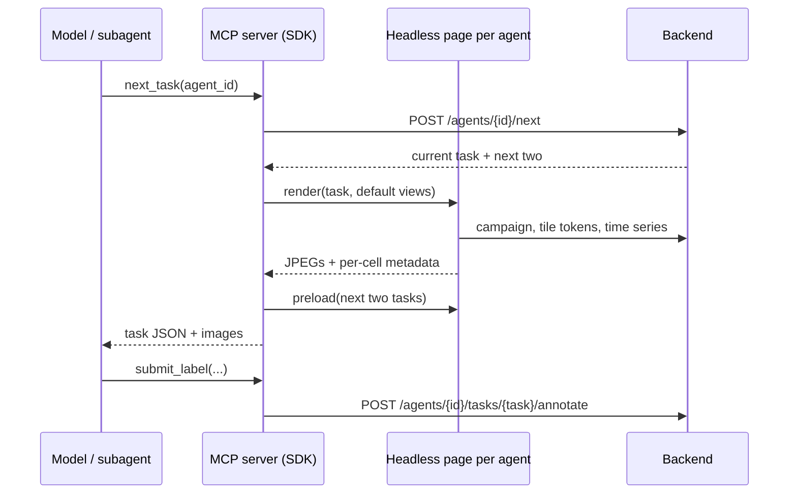

# Agentic labelling

A model can label the tasks of a campaign, alone or as a team of subagents. It works
through the `stacnotator` MCP server in the SDK: it looks at packed images of the imagery
around each task, asks for more detail when a point is unclear, and submits labels like any
other annotator.

## Setup

```bash
pip install "./sdk[agent]"                  # from the repo root: mcp + playwright
python -c 'import stacnotator as snt; snt.login("https://your-stacnotator.example.org")'
claude mcp add stacnotator -- python -m stacnotator.agent_mcp
```

Other MCP clients run `python -m stacnotator.agent_mcp` over stdio. Give the model the skill
in [`sdk/skills/stacnotator-labelling/SKILL.md`](../sdk/skills/stacnotator-labelling/SKILL.md):
it covers the tools, how to choose context and detail views, and how to split a run across
subagents.

Images are drawn in headless Chromium. The first time, the model asks before downloading it
(about 150 MB, `install_render_browsers`); you can also run
`python -m playwright install chromium` yourself. On a bare Linux machine Chromium may also
need system libraries: `python -m playwright install-deps chromium` (needs sudo).

A campaign with point tasks needs a sample extent set: it is the red box drawn around each
point so the model knows what it is labelling.

## Running a labelling run

Ask in plain words, e.g. "label 20 points of the Ukraine winter crop campaign with 4 agents".
The skill asks for whatever is missing (campaign, number of points, number of agents), then:

1. registers one agent per worker, with the points split evenly and take-over switched on,
2. launches one subagent per agent, each looping next task, extra views when needed, label or skip,
3. reports a table of task, label, confidence and evidence.

Ask it to watch the agents and it opens a window on your screen with each agent's latest
views. If you stop a run early, ask it to free the agents' tasks, or use the Agents page.

## How it works



- **Agents are annotators.** Registering creates a user owned by the signed-in account, adds
  it to the project and assigns it tasks with the normal assignment code. Labels, skips,
  statistics and review rows are ordinary annotations. `data.labelling_agents` only records
  the owner, campaign, description and the take-over setting.
- **Nothing is rendered on the server.** The MCP server opens `/agent-render?campaign=<id>`
  of the app in its own browser context per agent (so agents do not share tile connections)
  and calls `window.stacnotatorAgent` on it. The page draws with the same catalog, tile URLs,
  Planet scene search and time series code as the annotation page and returns the images.
  It signs in with the SDK login, which the MCP server hands to the page on request.
- **Campaign context and default views come from the page**, built from the campaign it
  loaded: sources with collections and slices, basemaps, time series, labels, form fields
  and the guide.
- **Views.** A view is a grid of cells, each a slice (with a visualization), a basemap or a
  time series chart (optionally cloud-free and smoothed), at a zoom and cell size the model
  picks. The image is captioned per cell and comes with metadata: dates, zoom, meters per
  pixel and the time series values.
- **Preloading.** Every `next_task` draws the agent's default views for its next two tasks in
  the background, so a steady loop gets its images without waiting. Default views live in
  the MCP server's memory and reset when it restarts.
- **Take-over.** An agent with take-over on that runs out of tasks takes the last queued task
  of the owner's agent on the campaign with the most work left.

## Agents page

`/projects/<p>/campaigns/<c>/agents` lists your agents on a campaign with done and remaining
counts. From there you can switch take-over per agent and free the unfinished tasks of one
agent or of all of them; labelled and skipped tasks stay.

## API

| route | |
| --- | --- |
| `POST /campaigns/{id}/agents` | register an agent and assign it `task_count` tasks |
| `GET /campaigns/{id}/agents` | total and open tasks, and your agents with their progress |
| `POST /campaigns/{id}/agents/release-tasks?agent_id=` | free unfinished tasks of one or all of your agents |
| `GET /agents/{agent_id}` | one agent |
| `PATCH /agents/{agent_id}` | switch take-over |
| `POST /agents/{agent_id}/next` | the current task and the next two, taking over work when empty |
| `POST /agents/{agent_id}/tasks/{task_id}/annotate` | label or skip |

## Limits

- Everything runs on the machine of whoever runs the MCP server: each agent's page is a
  Chromium renderer drawing several maps at once, so many parallel agents are bound by that
  machine's memory and CPU.
- Registrations go one at a time: task assignment locks the campaign's open pool, so two at
  once would leave the second agent without tasks.
